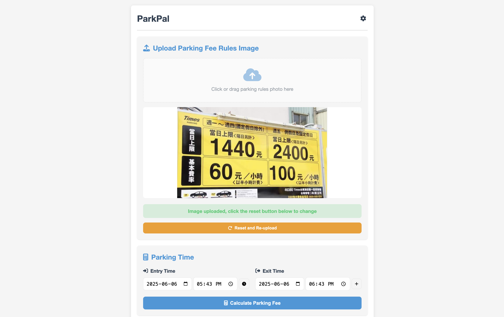

# ParkPal

A web-based application that automatically analyzes and calculates parking fees by uploading parking fee rule images. Using OpenAI API for image analysis and dynamically generating specialized parking fee calculation functions.



## Features

- **Image Analysis**: Upload parking lot fee rule images, automatically parse into structured data
- **Smart Calculation**: Use AI to dynamically generate calculation functions specific to parking rules
- **Easy Operation**: Intuitive interface design for convenient entry and exit time settings
- **Local Storage**: Analysis results and calculation functions are stored locally, eliminating the need for repeated uploads and analysis
- **Responsive Design**: Interface suitable for both desktop and mobile devices

## How to Use

1. **Set API Key**: Click the settings icon in the top right corner to enter your OpenAI API key
2. **Upload Rule Image**: Click or drag and drop parking lot rule photos to the upload area
3. **Set Parking Time**: Choose entry and exit date/time (default is current time and one hour later)
4. **Calculate Fee**: Click the "Calculate Parking Fee" button to get the estimated result
5. **Reset Function**: Click "Reset and Re-upload" button when you need to upload a new image

## Technical Implementation

- **Frontend**: Pure HTML, CSS and JavaScript (no framework)
- **API Integration**: OpenAI Vision API for image analysis
- **Code Generation**: Using OpenAI to generate specialized JavaScript calculation functions
- **Local Storage**: Using localStorage to save analysis results and calculation functions
- **Error Handling**: Complete error capture and user notification system

## Installation and Deployment

1. Clone this repository:
   ```bash
   git clone https://github.com/Jacky97s/parkpal.git
   cd parkpal
   ```

2. Open the index.html file or run using a simple HTTP server:
   ```bash
   # Using Python's simple HTTP server
   python -m http.server

   # Or using Node.js http-server (requires installation)
   npx http-server
   ```

3. Visit `http://localhost:8000` in your browser

## Notes

- A valid OpenAI API key is required to use the image analysis function
- Analysis accuracy depends on the clarity of the uploaded image and the complexity of the rules
- Calculation results are for reference only; actual fees may vary due to parking lot policy adjustments

## Privacy Statement

- All data is stored only in the user's local browser
- API keys are used only for communication with OpenAI services and are not sent elsewhere
- Uploaded images are only used to parse rules and are not permanently stored on any server

## License

This project is licensed under the MIT License. Please see the LICENSE file for details.

## Contribution Guidelines

Problem reports, feature requests, or code contributions are welcome. Please follow these steps:

1. Fork this repository
2. Create your feature branch (`git checkout -b feature/amazing-feature`)
3. Commit your changes (`git commit -m 'Add some amazing feature'`)
4. Push to the branch (`git push origin feature/amazing-feature`)
5. Open a Pull Request

## Contact

Jacky97s - <jacky.han.hong@gmail.com>

Project Link: <https://github.com/Jacky97s/parkpal>